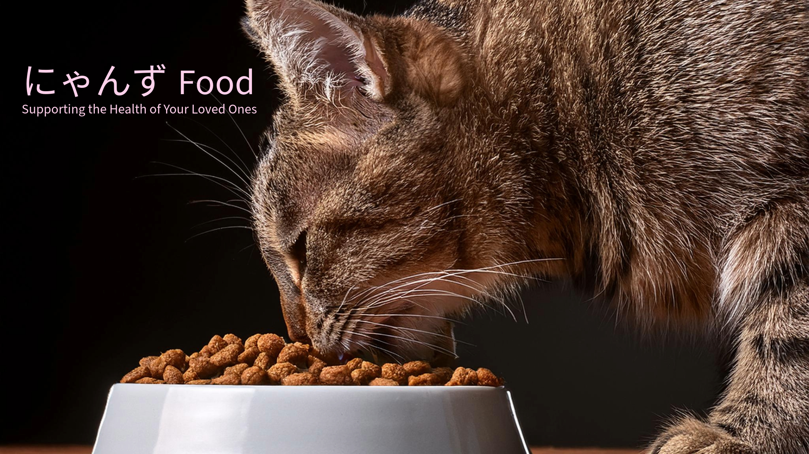

# にゃんずFood
 
 
<video controls src="https://github.com/user-attachments/assets/8d5a611a-b785-4efc-a416-bb25715a28cc" muted="false"></video>

## 制作目的
ECサイトを作成する際、初めてDockerを使用し、その使い方に慣れることで、開発環境のセットアップを学びました。 
また、RailsのMVC構造を活用してサイトを構築し、適切な設計パターンを学びながら開発を進めました。 
さらに、顧客目線で必要だと感じた機能や使いやすさを重視し、レイアウトの変更やタグ機能、検索機能を追加することで、 
ユーザーエクスペリエンスの向上に努めました。 
## サイト概要
### サイトテーマ
猫の健康に関心のたる人のための、ナチュラルやオーガニック製品FOOD。
無添加、グルテンフリー、素材をのままの物を重視した品揃えました。
​
### テーマを選んだ理由
今では、猫や犬などの動物をペットの枠を超えて、家族の一員として大切に思う人々が多くなっているのではないでしょうか。 
　猫の健康と栄養に関心を持つ飼い主が多いため、今回は猫のための健康FOODを集めたECサイトを作成しました。
作成理由としては、健康食品は増加しいていますがペットの人間化や高品質なペットフードへの需要増加によるものです。特に消費者はペットの健康と福祉に関心を持ち、 
ナチュラルやオーガニック製品が人気を集めています。これらのデータから、日本のペットフード市場は今後も成長が見込まれており、 
特に高品質な製品への需要が高まっています。しかし、その製品ごとのサイトが多く表品比較や探すのに時間がかかるのが不便さを感じました。 
そこで1つのサイトで表品をまとめて商品を購入できれば購入しやすくなると考えました。 

### ターゲットユーザ
- 猫の健康を重視する飼い主
- オーガニックやナチュラル製品に興味があるペットオーナー
- 無添加やグルテンフリーのペットフードを探している人
- ペットの食事に安全で高品質な素材を求める方
- アレルギーや食事制限が必要な猫を飼っている飼い主
- 猫のために自然食品や健康志向の製品を選びたい方
- ペットフードの成分や製造過程にこだわりを持つ方

### 主な利用シーン
- 猫の食事に健康を配慮する際 
健康問題を抱えた猫や、成長期の子猫に栄養価の高い食事を提供したい飼い主が、無添加やグルテンフリーの製品を探す際に役立ちます。
- アレルギーや食事制限に対応したフードを探すとき 
食事にアレルギーがある猫を持つ飼い主が、成分にこだわったオーガニックやナチュラル製品を見つけるために活用できます。
- ペットフードの品質にこだわる場合 
食材の出所や製造過程に敏感な飼い主が、安全で高品質なペットフードを選びたい時に、サイトの豊富な製品情報が役立ちます。
- 健康志向なライフスタイルを反映した猫の食事選び 
飼い主自身がオーガニックや自然志向な生活を送っており、そのライフスタイルを猫にも反映させたい時に、ナチュラルなペットフードの選択肢が利用されます。
- 日常の食事やご褒美として安心なフードを選ぶ時 
毎日の食事に健康を配慮したい時や、特別なご褒美として安心して与えられるフードを探している際に利用されます。
- 猫の健康状態を改善するための食事選び 
獣医の推奨を受けて、健康管理や体調改善のために特定の成分を含む食事を探している場合に適しています。

​
## 開発環境
- OS：Linux(CentOS)
- 言語：HTML,CSS,JavaScript,Ruby,SQL
- フレームワーク：Ruby on Rails
- JSライブラリ：jQuery
- IDE：VScode
-	仮想化・コンテナ：Docker
​
## 使用素材
AdobeExpress
